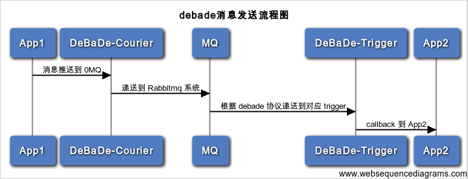

# debade

## 什么是 debade

> 一个基于 **[0mq](http://zeromq.org/)** 和 **[rabbitmq](https://www.rabbitmq.com/)** 的非持续化消息推送机制


## debade 消息发送流程



## 服务列表

### debade-courier

> debade-courier 为 debade 消息递送的第一步, 通过 `0mq` 监听 *3333* 端口, 在收到消息后, 根据 `queue` 配置, 提送消息到不同的 rabbitmq

### rabbitmq

> 提供消息队列服务, 进行消息分发到不同的 debade-trigger

### debade-trigger

> 根据消息体和配置, 进行 callback 


## 协议

> 本协议为使用 debade 进行通讯方式、以 JSON 结构数据格式设定的协议

debade 协议格式如下:

```
{
	"queue": "queue_name", //队列名称
	"data: {					//消息内容
		xx, xx,
	},
	"routing": "rk",			//routing_key 
}
```

### 消息体协议

> 消息体协议为如上 `data` 内的具体数据协议

debade 消息协议内容为:

```
{

	"method": "method_name",
	"params:" {
		xx: xx,
		xxx: xxx,
		xxxxx: xxxxx
	}
}
```

`method` 为调用的函数名称, `params` 为函数调用的消息参数列表

举例, tju 的站点对 checkPermission 结果进行反馈:

```
{
	"method": "YiQiKong/Control/checkPermission",
	"params": {
		"source": "tju",
		"equipment": "a183e3c95b28363f0f20942e3cef5db6",
		"user": 2222,
		"permission": "switchOn",
		"result": true,
	}
}
```

**在进行 debade 开发时候, 需严格按照如上协议进行消息设计**